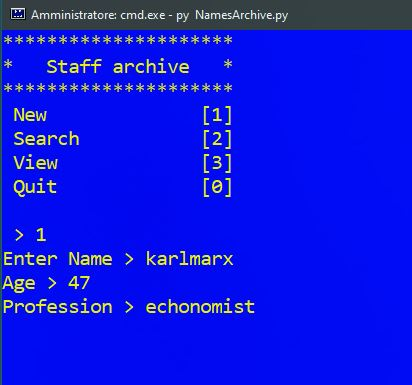
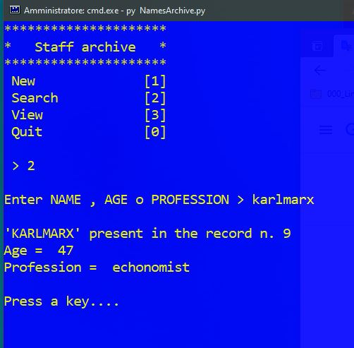
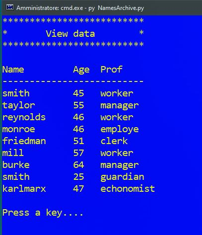

# Build-a-simple-menu
The menu can be useful to implement a simple menu to manage different scripts

The example used relates to the personnel archive of a company. 
There are 4 items in the menu:
* 0 - Quit
* 1 - New
* 2 - Search
* 3 - View
# NEW - 1

# SEARCH - 2

# VIEW - 3

The menu is based on a `while` loop in which there are several `if` statements.
The presence of the `CLS` instruction is used to clear the prompt. 
So it is clear that this program should be used on `WINDOWS` systems. 
There is probably a similar instruction also on `MAC OS` and `LINUX`.

CLS - [wiki](https://en.wikipedia.org/wiki/CLS_(command))
